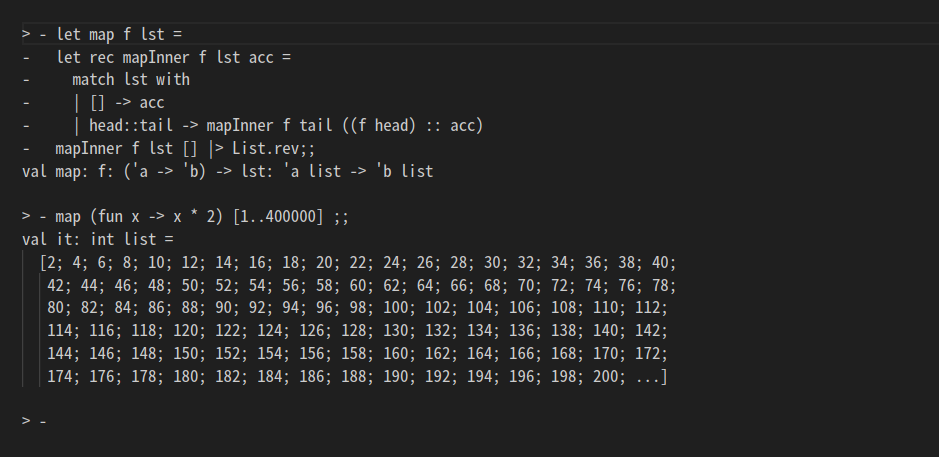
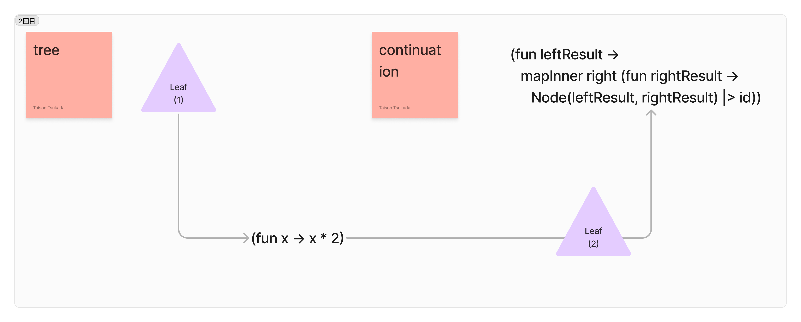
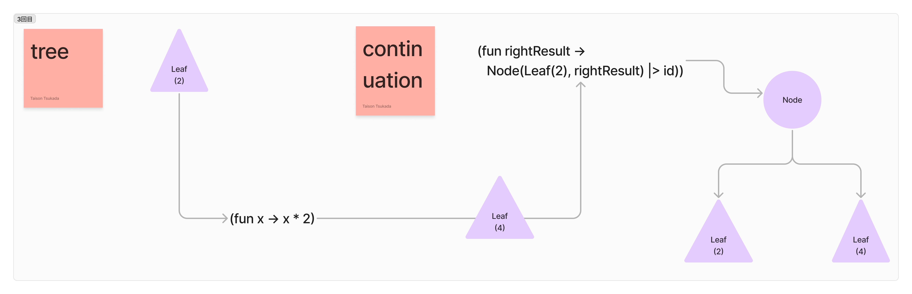

# 関数プログラミングと再帰
塚田竜勇孫

---

# 今日は再帰について話します。

---

# なぜ再帰?

再帰は関数プログラミングにおいて重要な概念。
関数プログラミングではループ構文の代わりに再帰を使用する。

---
ループ構文を使う場合、ミュータブルな値が必要になる

```csharp
static long Factorial(int n)
{
    long factorial = 1;
    for (int i = 1; i <= n; i++)
    {
        factorial *= i;
    }
    return factorial;
}
```

---
対して関数型言語では基本的に一度、作ったデータは変わることがなく、未来永劫その値を持ち続ける

関数プログラミングではこのような参照透過性を持つため、ループ構文ではなく再帰で問題を解決する。
ローカル変数の代入を関数の引数の初期化で置き換えることができる。

```fsharp
let rec factorial n =
    match n with
    | 0 -> 1
    | _ -> n * factorial (n - 1)
```
---
# Listのmapを実装して再帰について学んでみる
まずリストをパターンマッチする。
```fsharp
let map f lst =
  match lst with
  | [] -> failwith "TODO"
  | head :: rest -> failwith "TODO"
```
---
空のリストが渡された場合は、空のリストを返す
```fsharp
let map f lst =
  match lst with
  | [] -> []
  | head :: rest -> failwith "TODO"
```
---
リストが空でなかった場合は、先頭の要素をheadとそれ以降の要素を含むリストに分割する。
引数で受け取った関数をheadに適用させる。
`::`で`f head`の返り値と再帰呼出しして得た結果のリストを結合させる。
```fsharp
let rec map f lst =
  match lst with
  | [] -> []
  | head :: rest -> (f head) :: (map f rest)
// [1;2;3] = 1::2::3::[] = 1::(2::(3::[]))
```
---
# mapを実装できた！！だが問題がある
この実装には問題がある。

```fsharp
let rec map f lst =
  match lst with
  | [] -> []
  | head :: rest -> (f head) :: (map f rest)
```
---
再帰呼び出しがされるたびに関数がコールスタックに追加され、
今のままの実装では長いリストを扱う場合は、Stack overflowが発生してしまう。


---
# そんなときに末尾再帰
## 末尾再帰とは

再帰呼出しが一つだけで、その呼び出しが関数の最後の処理になっている再帰のパターンのこと。
末尾再帰はコンパイラに再帰呼び出しを関数呼び出しではなく、goto文(戻り先を保存しない飛び越し命令)に変換させる。goto文はスタックに追加されない。

これを末尾呼び出し最適化と呼ぶ。

---
# アキュムレータを用いて末尾再帰でmapを実装する

mapの中に補助関数として再帰関数を定義し、引数でアキュムレータを受け取れるようにする。
空のリストを受け取った場合は、アキュムレータを返すようにする。
それ以外のリストの場合はfにheadを適用した値をアキュムレータに累積していく。

```fsharp
let map f lst =
  let rec mapInner f lst acc =
    match lst with
    | [] -> acc
    | head::rest -> mapInner f rest ((f head) :: acc)
  mapInner f lst [] |> List.rev
```
---
# やったか?..
先ほどと同じ要素数でmapを呼び出してもStack overflowは発生しなくなった。


---

# 木構造の場合
このような木構造があるとする

```fsharp
type 'a Tree =
  | Leaf of 'a
  | Node of 'a Tree * 'a Tree
```

---
# 木構造におけるmap
リストと同じような形でmapを書くとこうなる。
この複数再帰呼び出しをする場合、アキュムレータを使ってもうまくいかず、
このコードは末尾再帰になっていない。
```fsharp
let rec map f tree =
  match tree with
  | Leaf x -> f x |> Leaf
  | Node (left, right ) ->
      let leftResult = map f left
      let rightResult = map f right
      Node(leftResult, rightResult)
```
---

# そんなときに継続渡しスタイル(CPS)
「次に何をするか」という関数を再帰呼び出しの引数に渡していく。
これは末尾再帰になっていて、スタックにはプッシュ追加されない。
```fsharp
let map f tree =
  let rec mapInner tree continuation =
    match tree with
    | Leaf x -> 
        Leaf(f x) |> continuation
    | Node (left, right) ->
        mapInner left (fun leftResult ->
          mapInner right (fun rightResult ->
  mapInner tree id
            Node(leftResult, rightResult) |> continuation))
```
---
単純な木構造`Node (Leaf 1, Leaf 2)`でなにが起こっているのかを紐解いていく。
```fsharp
let map f tree =
  let rec mapInner tree continuation =
    printfn "tree: %A" tree
    match tree with
    | Leaf x -> 
        Leaf(f x) |> continuation
    | Node (left, right) ->
        mapInner left (fun leftResult ->
          mapInner right (fun rightResult ->
            Node(leftResult, rightResult) |> continuation))
  mapInner tree id
```
```shell
> mapTree (fun x -> x * 2) (Node (Leaf 1, Leaf 2));;  
tree: Node (Leaf 1, Leaf 2)
tree: Leaf 1
tree: Leaf 2
val it: int Tree = Node (Leaf 2, Leaf 4)
```
---
初回はnodeなので以下のパターンに入る。
```fsharp
| Node (left, right) ->
        mapInner left (fun leftResult ->
          mapInner right (fun rightResult ->
            Node(leftResult, rightResult) |> continuation))
```
.png)

---

2回目の再帰呼び出しはLeafなのでこのパターンに入る。
引数で受け取った関数を適用してその結果でcontinuationを呼び出す。

```fsharp
| Leaf x -> 
        Leaf(f x) |> continuation
```



---



---

このように継続を表す関数に「次に何をするか」を蓄積していくスタイルのことを継続渡しスタイル(CPS: Continuation Passing Style)と呼ぶ。
これは末尾再帰になっていて、スタックには追加されない。

```fsharp
let map f tree =
  let rec mapInner tree continuation =
    printfn "tree: %A" tree
    match tree with
    | Leaf x -> 
        Leaf(f x) |> continuation
    | Node (left, right) ->
        mapInner left (fun leftResult ->
          mapInner right (fun rightResult ->
            Node(leftResult, rightResult) |> continuation))
  mapInner tree id
```
---

# その他の再帰的な構造
他にも再帰的な構造はたくさんある。
それらに対しても再帰が有効である。

- ファイルシステム
- 業界
  - 大分類 > 中分類 > 小分類
- 組織図
- 世界の国
  - アジア > 東アジア > 日本
---

# まとめ
本日紹介したテクニックなどを用いて再帰を使いこなして、関数プログラミングを楽しもう